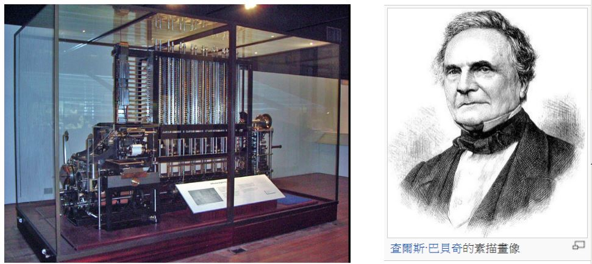
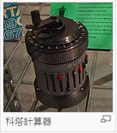
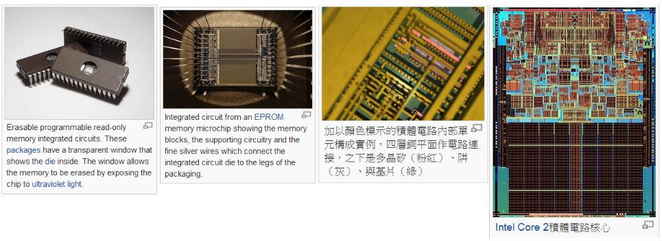
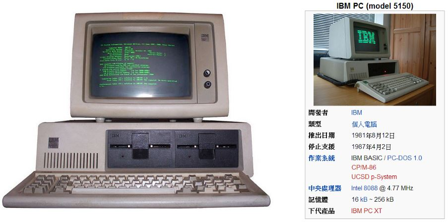
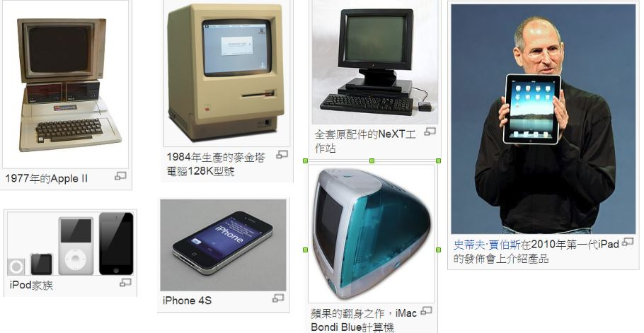

## 電腦演進的歷史

雖然有些教科書上會寫說「第一台電腦是 1941 年美國的 ENIAC」，但這種說法似乎太過簡化了！

很多故事，每個國家都有不同的版本。對於電腦，也是如此！

例如、有人會說中國人的算盤，也是一種電腦。但是、這種電腦不用電。

事實上、英文的電腦裏並沒有電這個字，Computer 是指一台可以用來計算的機器。與 Calculator 幾乎是同意詞。

1633年，英國牧師奧特雷德利用對數基礎，發明出一種圓形計算工具比例環（Circles of Proportion），後來逐漸演變成近代熟悉的計算尺。直到口袋型計算器發明之前，有一整個世代的工程師，以及跟數學沾上邊的專業人士都使用過計算尺。美國阿波羅計劃裡的工程師甚至利用計算尺就將人類送上了月球，其精確度達到3或4位的有效數位。

1623年，德國科學家施卡德建造出第一部機械式計算器，這部機械改良自時鐘的齒輪技術，能進行六位數的加減，並經由鐘聲輸出答案，因此又稱為「算數鐘」，可惜後來毀於火災，施卡德也因戰禍而逝。

1642年法國數學家巴斯卡為稅務所苦的稅務員父親發明了滾輪式加法器2，可透過轉盤進行加法運算。1673年德國數學家萊布尼茨使用階梯式圓柱齒輪加以改良，製作出可以四則運算的步進計算器，可惜成本高昂，不受當代重視。

1820年之後，機械式計算器開始廣為使用。法國人湯瑪斯以萊布尼茨的設計為基礎，率先成功量產可作四則運算的機械式計算器，後來命名為湯瑪斯計算器（Thomas Arithmometer），此後機械式計算器風行草偃，直到1970年代的150年間，有十進位的加法機、康普托計算器、門羅計算器以及科塔計算器等相繼面市。萊布尼茨還倡導過現代電腦的核心理論──二進位系統，不過直到1940年代（從1800年代的巴貝奇，到1946年誕生的ENIAC），大部分的設計連小數點都未能兼顧。

1725年，法國紡織工人魯修為便於轉織圖樣，在織布機套上穿孔紙帶，他的合作夥伴則在1726年著手改良設計，將紙帶換成相互串連的穿孔卡片，以此達到僅需手工進料的半自動化生產。1801年，法國人雅卡爾發明提花織布機，利用打孔卡控制織花圖樣，與前者不同的是，這部織布機變更連串的卡片時，無需更動機械設計，此乃可程式化機器的里程碑。

美國憲法規定每十年必須進行一次人口普查，1880年排山倒海的普查資料就花費了8年時間處理分析，因此美國統計學家赫爾曼·何樂禮 (Herman Hollerith) 在1890年開發出一種排序機，利用打孔卡儲存資料，再由機器感測卡片，協助美國人口調查局對統計資料進行自動化製表，結果不出3年就完成戶口普查工作。

1823年，英國數學家巴貝奇在政府的支持下，開始建造以蒸汽引擎驅動的差分機，用來比較數字間的差異，經歷10年未能竟功，巴貝奇遂轉而研究設計得更為完整，直接利用打孔卡輸入和儲存資料的分析機，可惜最後巴貝奇窮其畢生精力都未能造出任一完整的差分機或分析機。

英國著名詩人拜倫之女愛達 (ADA) 為分析機的打孔卡安排指令順序，也就是寫程式，因此被認為是世界第一位程式設計師。

### 電力機械時代

1900年代初期，機械式計算器、收銀機、記帳機等都被重新設計，改用電動馬達，配合變檔齒輪使其更加靈活。

### 真空管的發明

真空管的歷史可溯自燈泡的發明人湯瑪斯·愛迪生。1880年某日，他好奇地在燈泡中多放了一個電極，且灑了點箔片，結果發現了奇特的現象：第三極通正電時，箔片毫無反應；但通負電時，箔片隨即翻騰漂浮。當時愛迪生不知道此現象的起由，但由於他不經意的發現，這個現象後來被稱為愛迪生效應。一直到1901年，歐文·理查森提出定律，說明電子的激發態引起箔片漂浮，後更以此拿到1928年的諾貝爾物理獎。接著約翰·弗萊明在1904年發展出二極管，李·德佛瑞斯特（Lee De Forest）更在1907年作出第一個三極管。

真空管有燈泡般大小，早期的電腦是採用真空管做為基本元件，因此電腦通常很大，通常會佔滿一整個房間，而且功能不強。

### 二次大戰時期：德國楚澤 Z 系列電腦

1936年，在德國獨力研發的楚澤 (Konrad Zuse) ，開始打造以記憶能力和可程式化為特色的Z系列計算器。1938年，楚澤在柏林父親的公寓中完成Z1電腦，完全機械製造，使用二進位制，但是由於部分零件精確度的問題，運作並不穩定。

楚澤後續機種 Z3 電腦完成於 1941 年，使用打孔膠捲作為輸入程式的媒介，以電話型繼電器為基礎，運作順利，因此成為首部可程式控制的功能性電腦。Z3 電腦在許多方面都跟現代電腦相當類似，比如說使用了浮點數，是多項先進功能中的先鋒。

Z3 電腦在許多方面都跟現代電腦相當類似，比如說使用了浮點數，是多項先進功能中的先鋒。楚澤揚棄不好用的十進位制（巴貝奇早期設計皆使用十進位制）取簡單的二進位制，以當時的科技工藝來說，此舉使得他的機種易於製造，較為可靠，也有人認為這是楚澤比巴貝奇成功的主要原因之一。Z3電腦雖然被人忽略，不過已在 1990 年代證實合乎通用電腦定義（忽略其物理儲存容量限制）。

楚澤在1936年提出兩項發明專利，並且預言記憶儲存裝置將可同時儲存電腦指令和資料，這項遠見後來發展出范紐曼型架構，1949年為英國EDSAC電腦所應用。楚澤也主張第一款電腦高階程式語言是他所設計（Plankalkül，1945年完成，1948年發表），雖然這款程式語言直到2000年才在柏林自由大學首度成功執行──當時楚澤已經過世5年。

二次大戰時期，楚澤的部分發明遭到盟軍轟炸，摧毀殆盡。直到很久以後，英美工程師對他的發明仍有大片未知，IBM認識到這點，因此資助楚澤在戰後成立的公司，作為使用楚澤專利的交換。

### 二次大戰時期：美國的電腦發展

1939年，愛荷華州立大學的約翰·阿塔納索夫 (John Vincent Atanasoff) 和克里夫·貝理 (Clifford E. Berry) 開發出阿塔纳索夫貝理電腦（ABC Computer），用以解決線性方程式的問題。ABC使用超過 300 個真空管提高運算速度，以固定在機械旋轉磁鼓上的電容器作為記憶裝置，雖然不可程式化，但是採用二進位制和電子線路。

1939年，馬克一號在IBM安迪卡特（Endicott）實驗室起手開發，參考巴貝奇分析機，使用十進位制、轉輪式儲存器、旋轉式開關以及電磁繼電器，由數個計算單元平行控制，經由打孔紙帶進行程式化。

1943年開始建造的美國 ENIAC （Electronic Numerical Integrator And Computer, 電子數值積分計算器）是一部廣為人知的電腦，完工於 1945 年。很多教科書介紹電腦歷史都是從 ENIAC 開始的。

ENIAC是符合圖靈完全的裝置，「程式」對ENIAC來說，是一段電子程式儲存器到主機的距離，之間是由電纜和開關拼湊連接出來的運作狀態，不過在當時，光是能夠獨立運算這點，就已被認為是一大勝利。

約翰·馮紐曼曾經參與 ENIAC 專案，後來寫了一份《EDVAC報告書的第一份草案》（英語：First Draft of a Report on the EDVAC），該草案中提出了一個後來廣為人知的《馮紐曼架構》（von Neumann architecture）。

後來在 1948年，曼徹斯特大學根據馮紐曼架構建立了一台小規模實驗型電腦，稱為 Baby。

接著在1949年，曼徹斯特馬克一號電腦 (Manchester Mark I) 登場，功能完整，以威廉管和磁鼓作為記憶體媒介，並且引進索引暫存器的功能。

### 民用計算器

1948年，科塔計算器面市，這款機械式計算器造型輕便小巧，大小約莫有如一個胡椒粉研磨器。之後整個1950年代到1960年代，各種品牌相繼面市，爭奇鬥艷，好不熱鬧。

### 電晶體的發明

1947年「貝爾實驗室」的約翰·巴丁 (John Bardeen) 、沃爾特·布喇頓(Walter Brattain) 
和威廉·肖克利 (William Shockley) 發明了電晶體，這些電晶體可以用來取代真空管的功能，但是體積小了很多。

巴丁、布喇頓兩人發明的稱為三極體；而肖克利發明的稱為 PN 二極體。

「電晶體」是利用參了不同雜質的矽所製作出來的電子控制元件，而這種摻有雜質的矽，具有「某些情況下導通，某些情況下斷路」的特性，因此這些「摻有雜質矽材質」又稱為「半導體」。 (Semiconductor)。

1955年，肖克利在加州山景城創立了「肖克利實驗室股份有限公司」，聘用了很多年輕優秀的人才。但很快肖克利個人的管理方法因其公司內部不合，八名主要員工（後來被稱為八大叛徒）於1957年集體跳槽成立了仙童半導體公司，開發了第一塊「積體電路」 (IC, 就是台積電代工生產的那種)。而肖克利實驗室則每況愈下，兩次被轉賣後於1968年永久關閉。

「積體電路」是將「電阻、電容、電感、電晶體」等元件通通做在一塊矽基版上的「整合型矽晶片電路」(Integrated circuit, IC），這種技術大大縮小了電腦的大小，這也是為何後來電腦可以搬到桌上，甚至成為「手機或平版」隨身攜帶的主要原因了。

### 桌上型電腦

後來、當電腦可以縮小到放在桌上，電腦就開始進入家庭裏面，成為一種家電用品。

1977 年，賈伯斯 (Steve Jobs) 和沃茲尼克 (Stephen Gary Wozniak) 等人所成立的蘋果電腦 (Apple)，成功的生產出「蘋果二號」(Apple II) 這台電腦並打入家庭，於是開啟了「家用個人電腦」的時代。

當蘋果成功打入家用電腦市場之後，引發了商用電腦巨人 IBM 也想進入這個市場。但是 IBM 這個大公司的行動通常很緩慢，研發設計一款電腦需要四到五年的時間。

為了快速進入家用電腦市場，IBM決定破例設定一個特別小組。這個小組被授命繞過公司的規則來快速地提供一個市場產品。這個計畫的代號叫做「象棋計畫」（Project Chess）。

這個在「唐·埃斯特利奇」領導下的12人小組用了約一年的時間研製出了IBM PC。為了達到這個目的他們首先決定使用現成的、不同原始裝置製造商的元件。這個做法與IBM過去始終研製自己的元件的做法相反。其次他們決定使用開放結構，這樣其它生產商可以生產和出售相容的元件和軟體。IBM還出售其《IBM PC技術參考資料》，這份資料中包括一段 ROM BIOS原始碼。

結果、其它生產商很快就逆向分析了 BIOS 的程式，發展了其自己的、不侵犯版權的拷貝。1982年6月哥倫比亞資料產品公司（Columbia Data Products）推出了第一台IBM PC相容機。1982年11月康柏電腦宣布發展出第一台IBM PC相容的可攜式電腦Compaq Portable（1983年3月出產）。

IBM 釋出的這段 BIOS 可以說是影響深遠，BIOS 將電腦硬體與軟體整個切開，讓硬體與軟體兩者可以輕易的由不同的廠商設計生產。於是整個個人電腦產業不再由單一公司主導，而是由全世界很多公司分別設計製造其中一小部份，最後才組裝成一台電腦的。

不過、IBM 所料想不到的事情發生了，PC 架構釋出之後，微軟搶到「作業系統」，Intel 搶到「處理器」，而台灣則搶到「週邊設備、主機板與整台電腦的組裝」，形成了 「Microsoft + Intel + Taiwan」的 MIT 三股勢力，並且不斷的壯大。

這股勢力不只打垮了蘋果，還反過來幾乎摧毀了 IBM 的大電腦產業，導致這兩家公司逐漸衰弱。

雖然、蘋果搶先推出了「視窗型的電腦」LISA 與麥金塔，但是銷售卻不是很好，於是 1985 年時「賈伯斯」因此被自己創辦的蘋果電腦給開除，落寞了一陣子，但是後來又重新振作起來。接著創辦了 NeXT 電腦公司並投資創立「皮克斯」動畫公司。

後來、在 1997 年蘋果又找賈伯斯回來重掌大權，而賈伯斯確實也不負所望，透過 iPod、iPhone、iPad 等一系列產品，再度成為電腦領域的傳奇人物。

### 參考文獻
* [維基百科：計算機硬體歷史](http://zh.wikipedia.org/wiki/%E8%A8%88%E7%AE%97%E6%A9%9F%E7%A1%AC%E9%AB%94%E6%AD%B7%E5%8F%B2)
* [維基百科：阿塔那索夫貝理電腦](http://zh.wikipedia.org/wiki/%E9%98%BF%E5%A1%94%E7%BA%B3%E7%B4%A2%E5%A4%AB-%E8%B4%9D%E7%91%9E%E8%AE%A1%E7%AE%97%E6%9C%BA)
* [維基百科：電子數值積分計算機](http://zh.wikipedia.org/wiki/ENIAC)
* [維基百科：真空管](http://zh.wikipedia.org/wiki/%E7%9C%9F%E7%A9%BA%E7%AE%A1)
* [維基百科：電晶體](http://zh.wikipedia.org/zh-tw/%E6%99%B6%E4%BD%93%E7%AE%A1)
* [維基百科：半導體](http://zh.wikipedia.org/wiki/%E5%8D%8A%E5%AF%BC%E4%BD%93)
* [維基百科：史蒂夫·賈伯斯](http://zh.wikipedia.org/wiki/%E5%8F%B2%E8%92%82%E5%A4%AB%C2%B7%E4%B9%94%E5%B8%83%E6%96%AF)

【本文由陳鍾誠取材並修改自 [維基百科]，採用創作共用的 [姓名標示、相同方式分享] 授權】

