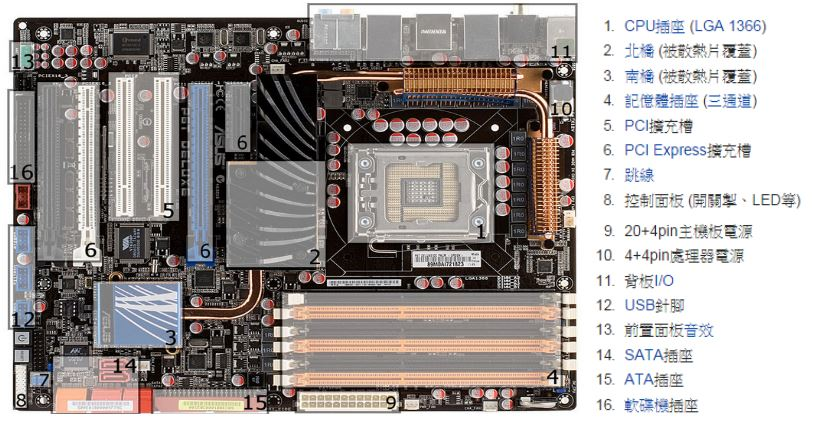
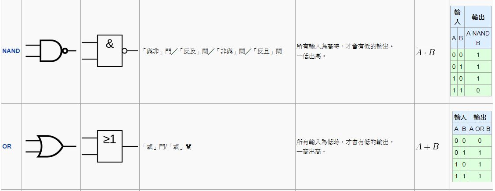

## 透視電腦的內部結構

電腦看起來很複雜，實際上呢？也真的是很複雜啦！

但是這些複雜的原因，通常是為了要「讓電腦跑得很快」，假如我們重新設計一台電腦，完全不考慮速度問題的話，其實是可以不要那麼複雜的。

在本文中，我們將透過真實的電腦圖片，瞭解電腦的外觀，然後再透過數位電路圖，逐步深入電腦的內部，讓讀者能理解電腦的基本架構。

### 主機板

如果你將電腦的機殼拆開，會看到一大塊的板子，很多元件都焊接在上面，那塊板子就稱為主機板。

### 處理器

然後、你可能會注意到裏面有一塊比較大的方型晶片，那塊通常是「中央處理器」。

### 處理器內部

當然、由於處理器封裝成一顆「黑黑的 IC 晶片」，所以我們看不到處理器的內部，就算沒封裝起來，我們也看不出這些密密麻麻的線路到底代表甚麼意義。

### 抽象架構

但是、抽象來看，電腦通常採用下列的「馮紐曼架構」，或者其變形後的「哈佛架構」。

### 細部元件

而處理器的內部，是由一種稱為「邏輯閘」的基礎元件所組成的，以下是一些常見的基本邏輯閘。

其實、只要用 AND (及閘), OR (或閘), NOT (反閘) 就可以組成所有「數位電路」了，其他元件都可以由這三種閘所組成。

甚至、我們只要用一種 NAND (反及閘)，就可以組出所有「數位電路」了，因為 NAND 可以組合出 AND, OR, NOT 閘。

您可以試試看用 NAND 閘來組合出 AND、OR、NOT ，這會是一個很好的練習題。

### 接下來呢？

當然、要將「中央處理器」分解到「閘」的層次，需要一些「理論與實務工具」，這將會是我們下期所要介紹的主題，我們下期見！

### 參考文獻
* [維基百科：主機板](http://zh.wikipedia.org/wiki/%E4%B8%BB%E6%9D%BF)
* [維基百科：中央處理器](http://zh.wikipedia.org/wiki/%E4%B8%AD%E5%A4%AE%E5%A4%84%E7%90%86%E5%99%A8)

【本文由陳鍾誠取材並修改自 [維基百科]，採用創作共用的 [姓名標示、相同方式分享] 授權】

