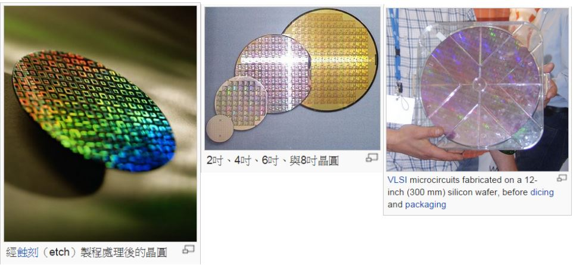
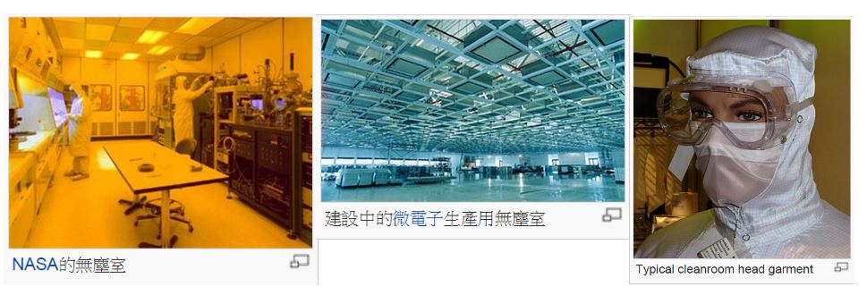
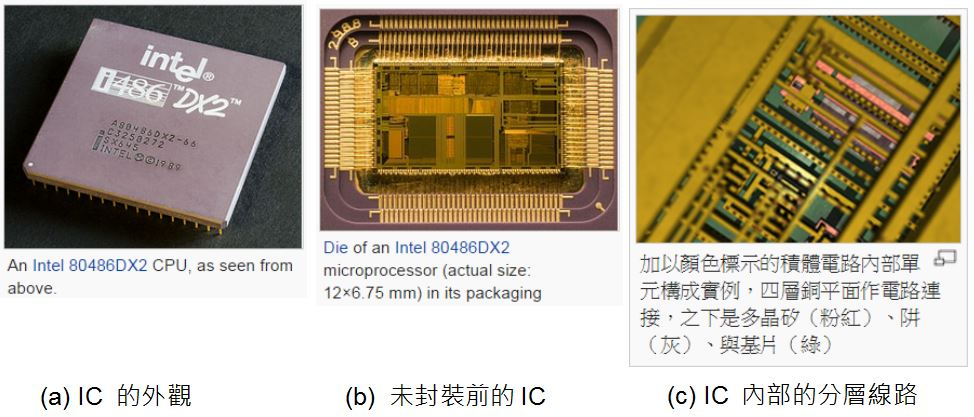
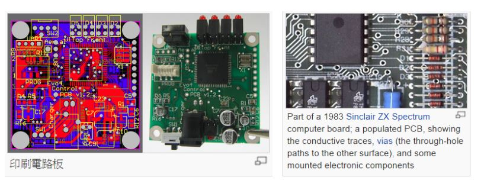
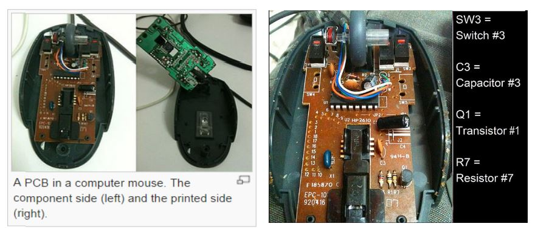
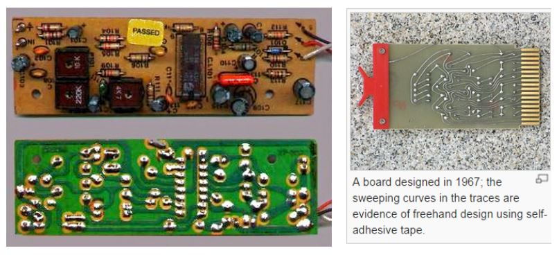
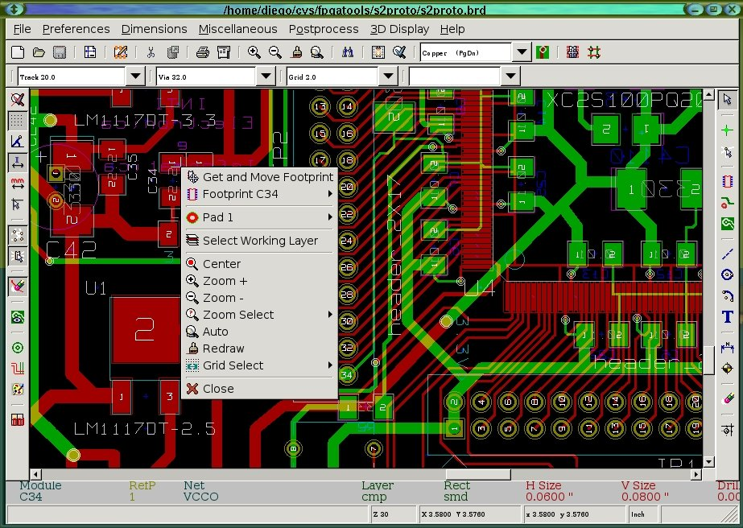

## 電腦工業的結構

在上文中，我們看到了「電腦的內部結構」，接著讓我們來看看整個電腦產業，是怎麼將一台電腦生產出來的。

但是、現代電腦已經不止是桌上擺的那種「個人電腦」，包含 iPad、手機、甚至汽車內部、微波爐等各種電子裝置裏，通常都存在著「電腦」，或者說「處理器」。

因此、本文所說的電腦產業，也包含這些看起來不像電腦的產業。

### IC 晶片產業

IC 是由晶圓加工切割後所製成的產品，而晶圓是矽沙(也就是沙子裏大量存在的那種透明小顆粒) 不斷提煉，經過長晶的程序，得到的超高純度矽晶柱。這種晶柱經過切割成薄片之後，就是矽晶圓了。

矽的純度越高，IC 生產的良率 (良好比率) 就會越高，因此晶圓廠裏要盡可能的保持純淨，避免任何的灰塵進入，所以除了盡可能的用「機器自動化」來完成生產任務之外，要進入晶圓廠的無塵室之前，一定要先穿上類似太空裝的隔離衣，避免你身上的灰塵或分泌物「感染」無塵室，降低 IC 生產的良率。

但是、可想而知的，當你好不容易花了十幾分鐘穿上那一身太空裝進到無塵室，突然想要尿尿的時候該怎麼辦呢？ (關於這個問題，可以請教「幫寶適」或「包大人」公司，應該就會有解答了！O My God，可憐的晶圓廠工程師啊 ....)

關於晶圓 IC 的生產過程，建議讀者可以看看下列的 PDF 文件，文件中說明得蠻清楚的。

* [昭華科技 - 晶圓製造、處理、半導體構裝與測試 (PDF)](http://www.zhaohua8.cn/Admin/UploadFile/2008102381041364.pdf)

IC 是積體電路 (Integrated circuit) 的簡稱，也就是將一大堆電晶體放入一塊矽晶片上，經過摻入特定雜質形成電路，接著加上接腳並封裝之後，就形成了我們今日看到的 IC 晶片。

上述的矽晶圓是整個電腦產業的基礎材料，而 IC 則是最重要的核心元件。

目前、世界上生產晶片最多的前三大公司，是生產處理器的英特爾 (Intel)、南韓的三星電子 (Samsung)、與台灣專門做晶圓代工的台積電公司 (TSMC)。

IC 的生產是一個「超極資本密集產業」，要建立一個 12 吋晶圓的生產工廠，必須耗費將近一千億的資金。所以、千萬不要想在家裏自己生產 IC。

(我記得有某個晶圓廠大亨說過，每個男人的生命中都應該有一座晶圓廠 ....)

(如果這句話成立的話，那我應該就不算是男人了 ....)

### PCB 電路板產業

除了 IC 以外，在電腦裏佔用最大空間的通常是「印刷電路板」(Printed circuit board, PCB)，電路板的功能其實是將上面的各種元件，像是 「IC、電容、電感、電阻、與各種週邊裝置插槽」等，用印刷的銅線路連接起來的一種板子。

電路板所扮演的角色，其實就是馮紐曼架構裏的「匯流排」(BUS)，這些匯流排線路有些傳遞「資料訊息」、有些傳遞「位址訊息」，另外還有些傳遞「控制訊息」。

除了主機板之外，很多週邊裝置裏也都含有電路板。舉例而言，以下是一隻滑鼠裏面的電路板，其中 SW3 上接一個開關，C3 上接一個電容，Q1 上接一個電晶體，而 R7 上則是接了一個電阻。

其實、除了工廠可以生產電路板之外，您也可以在家裡用「手洗」的方式「自製電路板」，像是以下的電路板就是用「手洗」的，而且線路並沒有很整齊。

當然、所謂的手洗並不是真正「用手去洗」，因為這些電路板的洗劑都是有毒性的，因此「手洗」時務必戴上防護手套，然後將線路畫在透明投影片上，然後用投影片去黏在一張完整蓋滿銅箔的電路板上去曝光，讓電路被光線固定後，最後再用洗劑將沒被固定的銅箔洗掉，就可以完成一張電路板了。

另外、如果有雕刻機等設備，也可以直接設計好線路後，交由電腦控制雕刻機將不要的銅箔刻掉，只留下線路的部分，這樣就可以「刻出電路板」了。

當然、工廠所使用的設備高級許多，所以生產起來會比自己洗快上很多，品質也會好很多。

台灣有很多廠商會生產電路板，也有很多人會設計電路板，設計電路板時會採用「設計電路板」的軟體，像是 Altium Designer、Eagle 或 KiCAD 等軟體來設計，只要把元件排好之後，這些軟體甚至可以自動幫你產生線路布局，而不需要你自己用手去畫，以下是 KiCAD 軟體所設計的一塊電路板圖形。

### 產業供應鏈

從整個產業的角度來看，我們可以看到下列流程，這個流程主要分成兩部份，一部分是 IC 晶片產業，另一部分是 PCB 電路板產業，兩者匯流後就形成了電腦產業的主要架構。

對於 IC 的製造，更詳細的流程如下所示：

> 前段製程：晶柱生長 => 切割成晶圓 => (成膜 => 微影成像 => 蝕刻 => 雜質參雜 => CMP 平坦化)* => 晶圓電路檢查
> 
> 後段製程：背部研磨 => 切割 => 黏晶 => 引線接合 => 塑膜封裝 (壓模) => 導線金屬鍍膜 => 導線加工 => 標印 => 電路檢查 => 預燒 => 電路檢查 => 入庫檢查 => 入庫 => 出貨

當然、以上只是大致的產業架構，而且所列出的主要是台灣的廠商。但是、我想應該足以描述出整個電腦產業的基本架構了。

### 參考文獻

* [維基百科：無塵室](http://zh.wikipedia.org/wiki/%E5%87%80%E5%AE%A4)
* [維基百科：晶圓](http://zh.wikipedia.org/wiki/%E6%99%B6%E5%9C%93)
* [維基百科：印刷電路板](http://zh.wikipedia.org/wiki/%E5%8D%B0%E5%88%B7%E7%94%B5%E8%B7%AF%E6%9D%BF)
* [Wikipedia:Printed circuit board](http://en.wikipedia.org/wiki/Printed_circuit_board)
* [Wikipedia:Wafer]

[Wikipedia:Wafer]:http://en.wikipedia.org/wiki/Wafer_(electronics)

【本文由陳鍾誠取材並修改自 [維基百科]，採用創作共用的 [姓名標示、相同方式分享] 授權】

