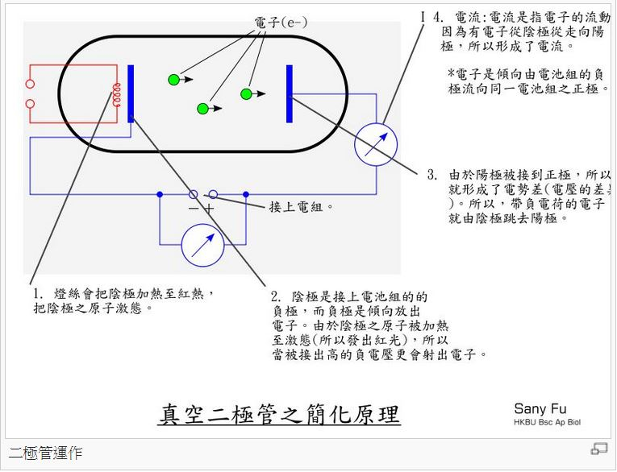
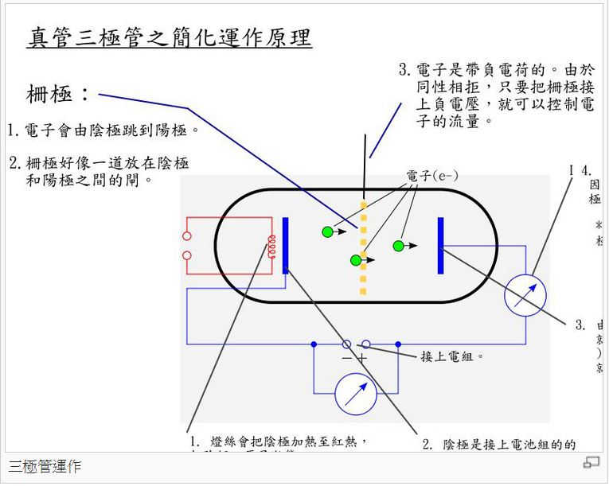

## 真空管的原理

現代的電腦很小，因為採用的電子材料是以矽晶片為材質的半導體，晶圓廠可以把很多電子元件通通做在一片 IC 矽晶片上，因此我們的手機或 iPad 等「攜帶型電腦」才能做得那麼小。

但是、在半導體之前，電腦所採用的主要元件是「真空管」，「真空管」就像燈泡一樣大，因此做出來的電腦，當然也是又大又笨重。

不過、雖然如此，對歷史好奇的「科技人」，還是會希望瞭解一下真空管的運作原理，本文將會介紹「真空管的運作原理」。

話說《愛迪生》(Thomas Alva Edison) 在 1880年的某日，他好奇地在燈泡中多放了一個電極，且灑了點箔片，結果發現了奇特的現象：第三極通正電時，箔片毫無反應；但通負電時，箔片隨即翻騰漂浮。當時愛迪生不知道此現象的起由，但由於他不經意的發現，這個現象後來被稱為愛迪生效應。

到了 1901 年，《歐文·理查森》 (Owen Richardson) 提出定律，說明電子的激發態引起箔片漂浮，後更以此拿到1928年的諾貝爾物理獎。接著《約翰·弗萊明》 (John Fleming) 在1904年發展出二極管，《李·德佛瑞斯特》（Lee De Forest）更在1907年作出第一個三極管。

真空管可以分為「二極管」與「三極管」兩種，二極管的運作原理如下圖所示：

但是、二極管是否導通全看電壓的大小，因此並不適合用來做為電腦的基本元件，因為缺乏控制極。

三極管解決了這個問題，以下是三極管的基本結構圖。

在三極管的結構中，只要能恰當的控制柵極的電壓，就能決定該真空管是否導通，這種結構和後來的半導體原理幾乎相同，只是所需的電壓通常較大而已。

有了上述的三極管，我們就可以做出電腦的最基本的 NAND 元件，然後就能利用這樣的元件組合出千變萬化的數位電路。

至於怎麼樣用 NAND 元件做出數位電路，還有怎麼用 NAND 元件做出處理器，則又是一個很長的故事，且讓我們先賣個關子，在下期的「少年科技人」雜誌再來探討了。

### 參考文獻
* [維基百科：真空管](http://zh.wikipedia.org/wiki/%E7%9C%9F%E7%A9%BA%E7%AE%A1)

