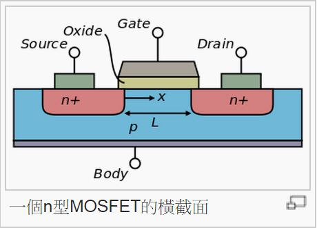
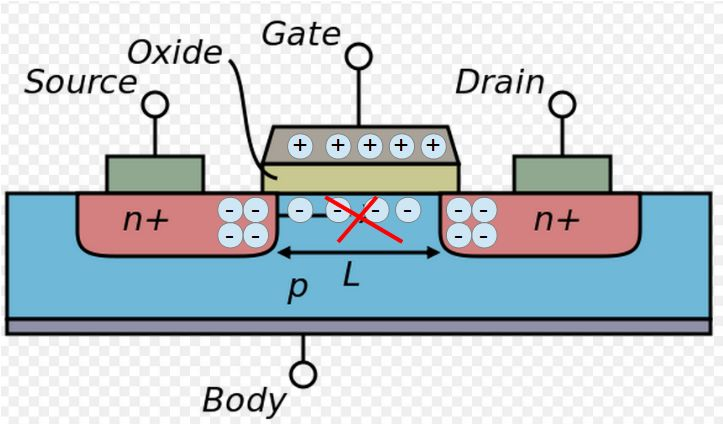
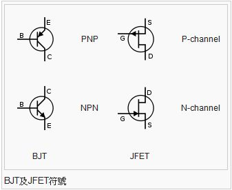
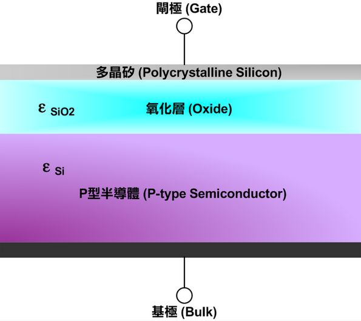
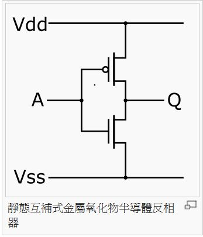

## 半導體的原理

處理器、電晶體、記憶體、與各種 IC 晶片都是由以矽為基礎材質的半導體所組成的，矽材質經過參雜五價元素 (砷、磷、銻、...) 後變成 N 型矽，如果參雜三價元素 (硼、鋁、鎵、銦...) 則會變成 P 型矽。

只要適當的安排這兩種不同類型的雜質的位置，就能形成我們所想要的電路。

現今的 IC 裏面，通常包含了數千萬個基本電路，但這些電路都是從一種稱為電晶體的基本元件所衍生而來的，因此要瞭解半導體，就必須先理解電晶體。

電晶體有兩種類型，第一種稱為「雙極性電晶體」（BJT），第二種稱為「場效電晶體」（FET），這兩種電晶體的結構與原理稍有不同。以下是一些電晶體的外觀樣式。

電晶體一般都有三個極，其中一極做為控制用，而其餘兩個則用作輸入和輸出。

「雙極性電晶體」(BJT) 可分為 NPN 型與 PNP 型，以下是一個 NPN 型的「雙極性電晶體」示意圖。

您可以看到在 NPN 型電晶體中，如果 B 極帶負電，那麼由於 NP 與 PN 之間的阻抗，使得電流將被卡住無法流過。但是若是 B 極帶正電，此時 NP 與 PN 介面中的正負電融合，引發電流流動，就會造成電子流由 E 流向 C 極，也就是電流由 C 流向 E 極。

雙極性電晶體也可以設計為受到光照射時導通，因為基極吸收光子會產生光電流，這類的電晶體一般會在封裝上有一透明窗，稱為「光電晶體」。這種光電晶體是「太陽能發電板」的主要材料，所以太陽能發電板的材料與 IC 基本上是相同的。 (這也是為何台積電會擁有很多太陽能發電方面專利的原因)。

但是、「雙極性電晶體」在 IC 製程上比較不方便，比較難用。因此現在用來製造 IC 的主流並非「雙極性電晶體」，而是以下所要介紹的「場效電晶體」。

以下是一個「場效電晶體」的示意圖，您可以看到「場效電晶體」與「雙極性電晶體」有所不同，基本上下圖中的「場效電晶體」是建構在 P 型基板上，然後摻入一些 N 型雜質後形成一塊一塊的 N 型區域。

在上述結構中，假如我們讓閘極 (Gate) 帶有正電，那麼兩個 N 型區中間所夾的 P 型區將會因為正電的吸引而帶有負電，這些負電與 N 型區的負電會相互排斥，因而讓電子無法通過，導致斷路的狀態。

但是如果我們讓閘極 (Gate) 帶有負電，那麼兩個 N 型區中間所夾的 P 型區將會因為負電的吸引而帶有正電，這些正電 (電洞) 將會與 N 型區的負電 (電子) 會相互吸引並融合，因而讓電子得以通過，形成通路狀態。

仔細觀察上述的運作原理，您會發現「場效電晶體」的運作與「雙極性電晶體」類似，但是又稍有不同。

當然、當我們在設計電路時，不會用上述的原理圖，而是會用符號代表電晶體，以下是電晶體符號的畫法。

目前電晶體的主流是採用一種稱為「金氧半場效電晶體」 (Metal-Oxide-Semiconductor Field-Effect Transistor, MOSFET）的技術，採用這個名稱的原因是因為其中包含一層氧化層，而閘極上可能會採用金屬作為材質 (但不一定要用金屬)。

當上述 MOSFET 「刻好電路」之後，就會形成下列的結構，這種結構是形成當今 IC 電路的主要結構。

如果要在電路圖中強調是 MOSFET 的話，可以採用下列的電路符號。

如果我們將兩組互補性的 MOSFET 組合在一起，可以做出一種非常省電的電路，稱為 CMOS (互補式金屬氧化物半導體, Complementary Metal-Oxide-Semiconductor)。

CMOS 雖然耗費了比較多的閘，但是非常的省電又不容易發熱，因此廣泛被用在「製作微處理器、 微控制器、靜態隨機存取記憶體以及互補式金屬氧化物半導體圖像感測器與其他數位邏輯電路」上，所以 CMOS 在半導體產業上佔有非常重要的地位。

當然、這些符號只是在設計時使用而已，真正的 IC 應該是長得像下面這些圖一樣，而不是一種符號而已。

### 參考文獻
* [維基百科：真空管](http://zh.wikipedia.org/wiki/%E7%9C%9F%E7%A9%BA%E7%AE%A1)
* [維基百科：電晶體](http://zh.wikipedia.org/zh-tw/%E6%99%B6%E4%BD%93%E7%AE%A1)
* [維基百科：半導體](http://zh.wikipedia.org/wiki/%E5%8D%8A%E5%AF%BC%E4%BD%93)
* [維基百科：場效應管](http://zh.wikipedia.org/wiki/%E5%9C%BA%E6%95%88%E5%BA%94%E6%99%B6%E4%BD%93%E7%AE%A1)
* [維基百科：元素週期表](http://zh.wikipedia.org/wiki/%E5%85%83%E7%B4%A0%E5%91%A8%E6%9C%9F%E8%A1%A8)
* [Wikipedia:Field-effect transistor](http://en.wikipedia.org/wiki/Field-effect_transistor)
